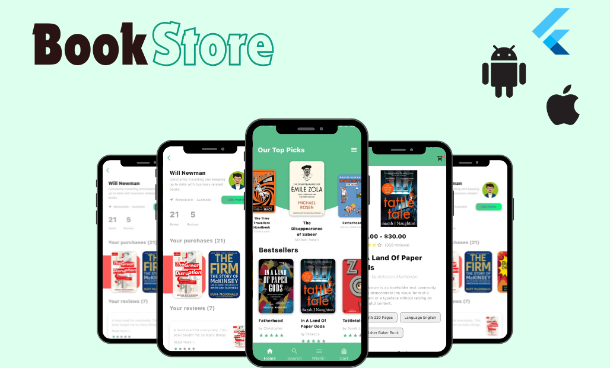

# Book Store Flutter App

A complete Flutter and Firebase-based mobile book store application where users can browse books, filter by author/genre/rating, add books to cart, checkout, read purchased books instantly, and share ratings and reviews. The project also includes an admin panel for managing books, authors, orders, and store content.

---

## Project Overview

Book Store Flutter App is a mobile e-commerce application developed using Flutter, Dart, Firebase Authentication, Cloud Firestore, and Firebase Storage.

The app provides two main experiences:

* Customer/User App
* Admin Panel

Customers can explore books, search and filter available titles, view complete book details, add books to cart, checkout, read purchased books instantly, and submit ratings and reviews.

Admins can manage the store by adding, editing, and deleting books, managing book details, uploading book images, handling authors, and viewing order-related data.

---

## Key Highlights

* Complete Firebase Authentication system
* Cloud Firestore database integration
* Firebase Storage for book images/files
* Customer book browsing experience
* Admin book management panel
* Cart and checkout flow
* Instant book access after purchase
* Rating and review system
* Filtering by author, genre, and rating
* Wishlist/favorites functionality
* Order tracking and order management
* Responsive Flutter UI
* Clean mobile shopping experience

---

## Tech Stack

### Mobile App

* Flutter
* Dart
* Material Design
* Custom UI Components

### Backend / Database

* Firebase Authentication
* Cloud Firestore
* Firebase Storage

### Packages Used

* firebase_core
* firebase_auth
* cloud_firestore
* firebase_storage
* image_picker
* cached_network_image
* flutter_rating_bar
* carousel_slider
* fl_chart
* intl

---

## User Features

### Authentication

* User registration
* User login
* Firebase Authentication integration
* Logout functionality
* Authentication-based navigation

### Book Browsing

* Browse available books
* View book cover, title, author, price, language, publisher, and description
* Explore books by category/genre
* View detailed book information
* Search books
* Filter books by:

  * Author
  * Genre
  * Rating

### Cart & Checkout

* Add books to cart
* View cart items
* Manage cart before checkout
* Checkout selected books
* Purchase flow for users
* Instant access to purchased books after checkout

### Book Reading

* Access purchased books
* Read books instantly inside the app
* Manage purchased/readable books

### Ratings & Reviews

* Add rating for purchased books
* Write review/feedback
* View book ratings
* Improve book discovery through user feedback

### Wishlist

* Add books to wishlist/favorites
* Manage saved books
* Quickly access favorite books

### Order Tracking

* View order status
* Track purchased books
* View order history

---

## Admin Panel Features

### Admin Dashboard

* View store overview
* Monitor books and orders
* Manage store activity

### Book Management

* Add new books
* Edit existing books
* Delete books
* Upload book cover images
* Add book details such as:

  * Book name
  * Author
  * Genre
  * Language
  * Publisher
  * Price
  * Description
  * Length/pages
  * Book image

### Author & Category Management

* Manage authors
* Organize books by author
* Manage genre/category-based browsing

### Order Management

* View customer orders
* Track order details
* Manage order status

---

## App Screens

Recommended screenshots to add:

```md



```

---

## Folder Structure

```txt
Book-Store-Flutter-App/
│
├── android/
├── assets/
│   ├── fonts/
│   └── img/
│
├── functions/
├── ios/
├── lib/
│   ├── admin/
│   │   ├── action/
│   │   ├── dashboard/
│   │   ├── list/
│   │   └── orders/
│   │
│   ├── common/
│   ├── common_widget/
│   ├── models/
│   │   └── book.dart
│   │
│   ├── view/
│   │   ├── account/
│   │   ├── book_detail/
│   │   ├── book_reading/
│   │   ├── cart/
│   │   ├── checkout/
│   │   ├── genre/
│   │   ├── home/
│   │   ├── login/
│   │   ├── main_tab/
│   │   ├── onboarding/
│   │   ├── our_book/
│   │   ├── search/
│   │   └── wishlist/
│   │
│   ├── firebase_options.dart
│   ├── firebaseauth.dart
│   └── main.dart
│
├── test/
├── web/
├── windows/
├── firebase.json
├── pubspec.yaml
└── README.md
```

---

## Firebase Setup

This project uses Firebase for authentication, database, and storage.

Before running the project, create and configure a Firebase project.

### Required Firebase Services

* Firebase Authentication
* Cloud Firestore
* Firebase Storage

### Firebase Authentication

Enable email/password authentication from Firebase Console:

```txt
Firebase Console > Authentication > Sign-in method > Email/Password
```

### Cloud Firestore

Create Firestore collections for:

```txt
users
books
cart
orders
wishlist
reviews
authors
genres
```

### Firebase Storage

Use Firebase Storage for:

```txt
book_covers/
book_files/
user_uploads/
```

---

## Installation Guide

### 1. Clone the Repository

```bash
git clone https://github.com/Syed-Sabeer/Book-Store-Flutter-App.git
cd Book-Store-Flutter-App
```

### 2. Install Dependencies

```bash
flutter pub get
```

### 3. Configure Firebase

Install FlutterFire CLI if needed:

```bash
dart pub global activate flutterfire_cli
```

Then configure Firebase:

```bash
flutterfire configure
```

This will generate or update:

```txt
lib/firebase_options.dart
```

### 4. Run the App

```bash
flutter run
```

---

## Firestore Data Model

Recommended Firestore structure:

```txt
books/
  bookId/
    name
    author
    genre
    description
    image
    language
    length
    publisher
    price
    rating
    createdOn
    updatedOn

users/
  userId/
    name
    email
    role
    createdAt

cart/
  userId/
    items/

orders/
  orderId/
    userId
    books
    totalAmount
    status
    createdAt

reviews/
  reviewId/
    userId
    bookId
    rating
    review
    createdAt

wishlist/
  userId/
    books/
```

---

## My Role

I developed this project as a Flutter mobile application with Firebase backend integration. My work included:

* Flutter UI development
* Firebase Authentication setup
* Firestore database integration
* Firebase Storage integration
* Book browsing flow
* Book detail screen
* Cart and checkout flow
* Instant book access after purchase
* Wishlist/favorites feature
* Rating and review system
* Admin dashboard development
* Admin book add/edit/delete functionality
* Book image upload handling
* Filtering and search functionality
* Order tracking and order management
* App navigation and user experience design

---

## Project Purpose

This project was created to practice and demonstrate mobile app development using Flutter and Firebase. It shows how a real-world e-commerce-style book store app can be built with user authentication, cloud database, admin management, cart, checkout, reviews, and digital product access.

---

## Future Improvements

* Add payment gateway integration
* Add push notifications for orders
* Add advanced admin analytics
* Add book recommendations
* Add PDF/ePub reader support
* Add dark mode
* Add user profile editing
* Add coupon/discount system
* Add better Firestore security rules
* Add role-based admin access
* Add order invoice generation
* Add unit and widget tests
* Improve folder structure using feature-based architecture
* Add Provider, Riverpod, or Bloc for state management

---

## Security Notes

Before making this project production-ready:

* Do not expose admin-only features to normal users
* Add proper Firestore security rules
* Restrict book upload/delete access to admins only
* Protect purchased books from unauthorized access
* Validate all user inputs
* Avoid storing sensitive data directly in the app
* Never upload private service account keys
* Use Firebase test rules only during development

---

## Author

**Syed Sabeer Faisal**
Software Engineer | Flutter & Full-Stack Developer

GitHub: https://github.com/Syed-Sabeer
LinkedIn: Add your LinkedIn link here
Portfolio: Add your portfolio link here

---

## Disclaimer

This project is created for educational and portfolio purposes. Book data, images, and files used in the public/demo version should be sample content, public-domain content, or content used with permission.
